

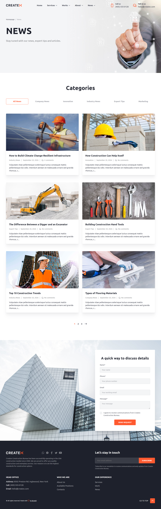
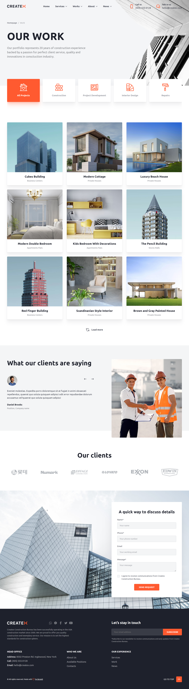
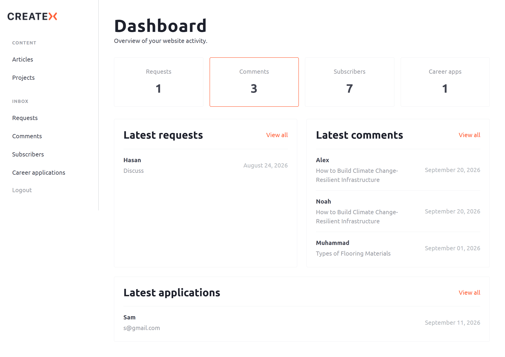
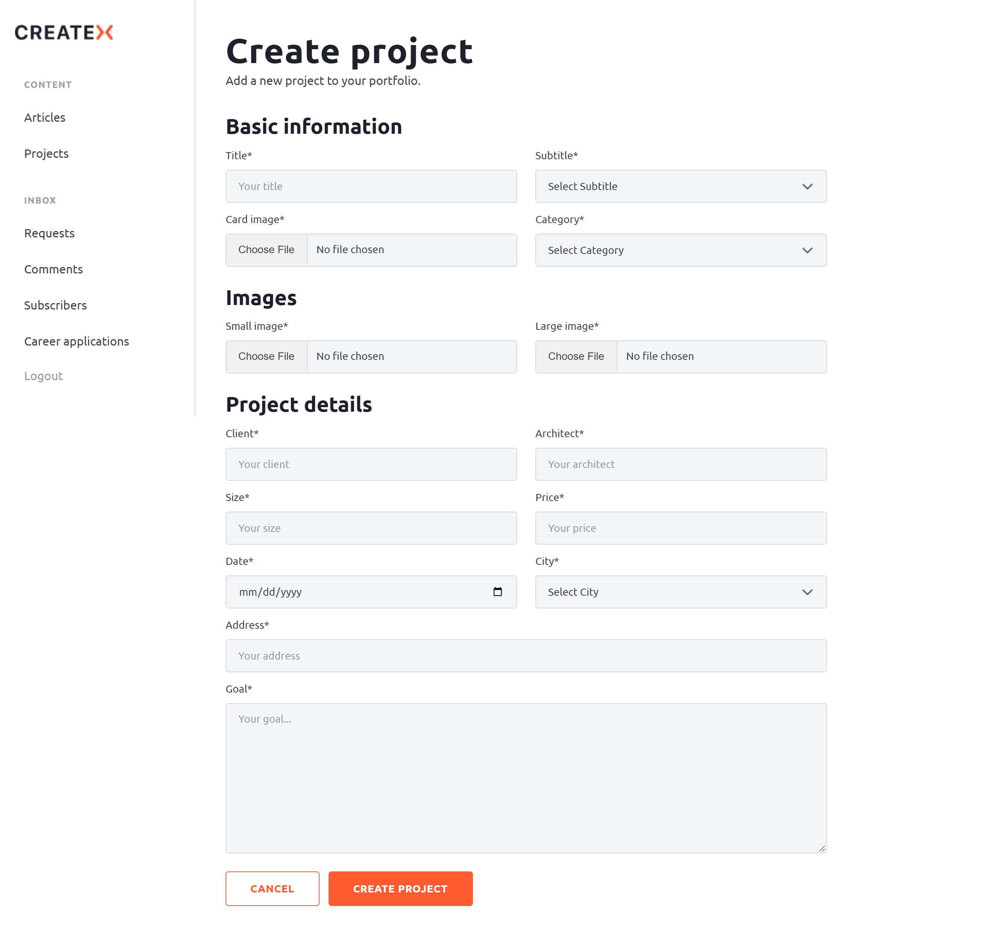
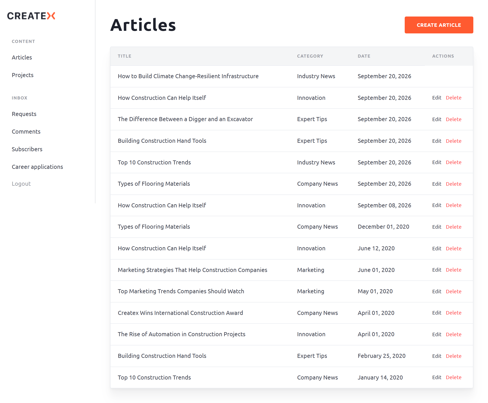
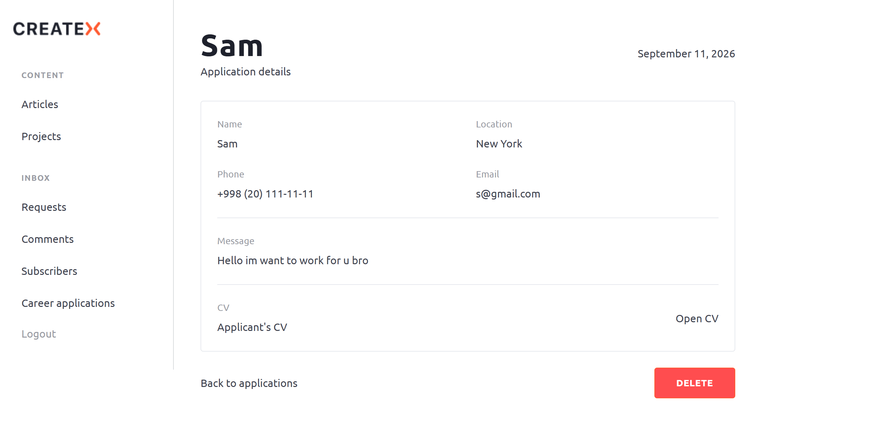

# Createx

A full-stack construction company website built with **Flask, JavaScript, Vite and SCSS**.

The project includes a responsive public website, an admin panel for managing content and requests, user authentication, form submissions, image and CV uploads, and Telegram notifications.

**Design source:** [Figma](https://www.figma.com/design/HtQ2NJqGSLwnDKKvOvQ2Gj/YouTube-Createx-Marathon?node-id=1539-1449&t=VTVzmd9umA0zzzJK-0)

## Technologies

* Python
* Flask
* Flask-SQLAlchemy
* PostgreSQL
* Supabase
* Gunicorn
* HTML
* SCSS
* JavaScript
* Vite
* Swiper
* IMask
* LightGallery
* Simplebar

## Screenshots

### Home


### About


### News


### Projects


### Admin Dashboard


### Admin Form


### Admin Panel


### Admin Details


## Installation

Clone the repository:

```bash
git clone https://github.com/ikrom0/Createx.git
cd Createx
```

Create a virtual environment:

```bash
python -m venv .venv
```

Activate it on Windows:

```bash
.venv\Scripts\activate
```

Install Python dependencies:

```bash
pip install -r requirements.txt
```

Install frontend dependencies:

```bash
npm install
```

Create a `.env` file and add the required environment variables:

```env
SECRET_KEY=your-secret-key

DATABASE_URL=your-database-url

SUPABASE_URL=your-supabase-url
SUPABASE_KEY=your-supabase-key

TELEGRAM_BOT_TOKEN=your-bot-token
TELEGRAM_CHAT_ID=your-chat-id
```

Run database migrations:

```bash
flask db upgrade
```

Build frontend assets:

```bash
npm run build
```

Run the Flask application locally:

```bash
python app.py
```

The application will be available at http://127.0.0.1:5000.

For production, the application is served using Gunicorn:

```bash
gunicorn app:app
```